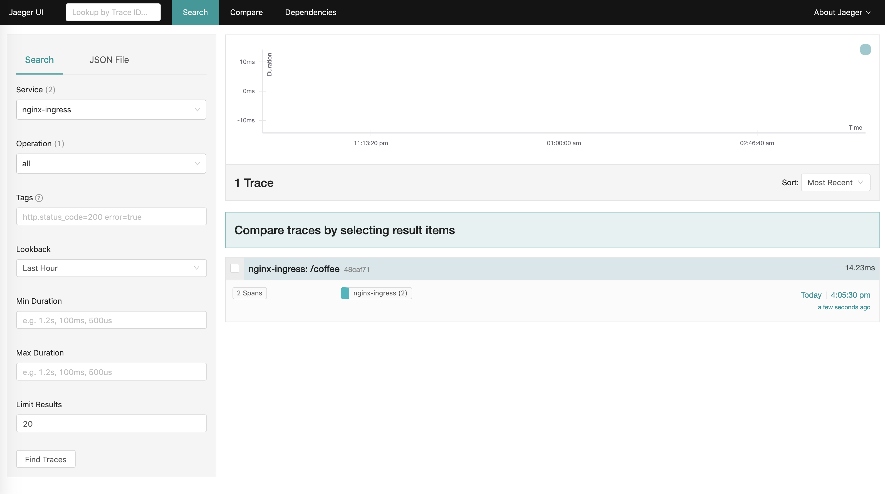
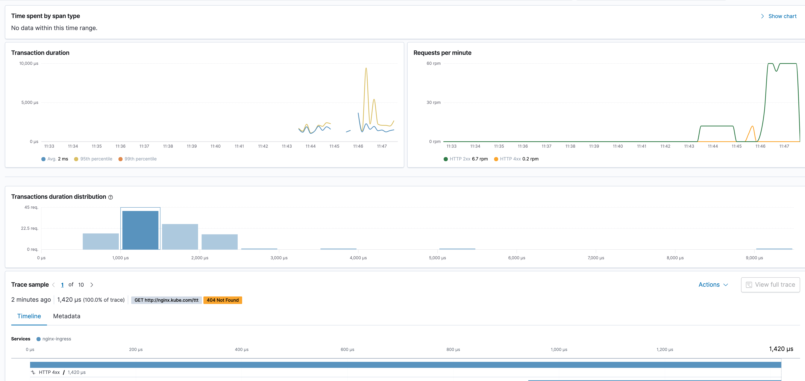

# Nginx Ingress Controller Opentracing Support

In this example we deploy the NGINX or NGINX Plus Ingress Controller and a simple web application. Then we enable OpenTracing and use a tracer (Jaeger) for tracing the requests that go through NGINX or NGINX Plus to the web application.

## Prerequisites

The default Ingress Controller images don’t include the OpenTracing module required for this example. 

### Download the Nginx ingress offical repo 
```
git clone https://github.com/nginxinc/kubernetes-ingress/tree/master/build 
```
### Create docker image by using this repo

```
$ make clean
$ make DOCKERFILE=DockerfileWithOpentracing PREFIX=YOUR-PRIVATE-REGISTRY/nginx-ingress
 ```
PS: I already created an one, you can get it by using this dockerhub repo: wangsiming519/nginx-ingress:opentracing_1.7.0


## Step 1 - Deploy Ingress Controller 

Run below commands:
```
$ git clone https://github.com/siming-diligent/kubernetes-ingress/  #here i use my own image in dockerhub
$ cd kubernetes-ingress/deployments
```
Configure RBAC
```
$ kubectl apply -f common/ns-and-sa.yaml
$ kubectl apply -f rbac/rbac.yaml
```

Create Common Resources
```
$ kubectl apply -f common/default-server-secret.yaml
$ kubectl apply -f common/nginx-config.yaml
$ kubectl apply -f common/vs-definition.yaml  #only works for k8s >= 1.16 
$ kubectl apply -f common/vsr-definition.yaml #only works for k8s >= 1.16 
$ kubectl apply -f common/ts-definition.yaml  #only works for k8s >= 1.16 
```

Deploy the Ingress Controller
```
$ kubectl apply -f deployment/nginx-ingress.yaml
```

Create NodePort to access ingress Controller
```
$ kubectl create -f service/nodeport.yaml
```


To get more info, you can visit this page: https://docs.nginx.com/nginx-ingress-controller/installation/installation-with-manifests/


## Step 2 - Deploy testing App

There is a quick demo app which use nginx sample

```
kubectl apply -f app-nginx-deployment.yaml
kubectl apply -f demo-ingress.yaml
```

And you can use below command to check
```
IC_IP=<your ingress svc IP>
IC_HTTPS_PORT=80
curl --resolve nginx.kube.com:$IC_HTTPS_PORT:$IC_IP http://nginx.kube.com
```


## Step 3 - Deploy a Tracer (Or jump to Step6) 
PS: There are 2 ways to do this.  if you want to keep it simple, just contiune reading by using all-in-one Jaeger solution

1. Use the [all-in-one dev template](https://github.com/jaegertracing/jaeger-kubernetes#development-setup) to deploy Jaeger in the default namespace. **Note:** This template should be only used for development or testing.
   ```
   kubectl create -f https://raw.githubusercontent.com/jaegertracing/jaeger-kubernetes/master/all-in-one/jaeger-all-in-one-template.yml
   ```

2. Wait for the jaeger pod to be ready:
   ```
   $ kubectl get pod

   NAME                      READY     STATUS   
   jaeger-6c996dbcd9-j5jzf   1/1       Running
   ```

PS:  you need to double check your Nginx-ingress configmap file, to make sure the "localAgentHostPost" is pointing to all-in-one Jeager Agent service  

## Step 4 - Enable OpenTracing
1. Update the ConfigMap with the keys required to load OpenTracing module with Jaeger and enable  OpenTracing for all Ingress resources.
   ```
   kubectl apply -f nginx-ingress-controller-config.yaml
   ```

## Step 5 - Test Tracing
1. Make a request to the app. 
   
   **Note:** $IC_HTTPS_PORT and $IC_IP env variables should have been set from the Prerequisites step in the complete-example installation instructions.
   ```
   curl --resolve cafe.example.com:$IC_HTTPS_PORT:$IC_IP https://cafe.example.com:$IC_HTTPS_PORT/coffee --insecure
   ```
1. Forward a local port to the Jaeger UI port on the Jaeger pod:
   ```
   kubectl port-forward <YOUR_JAEGER_POD> 16686:16686
   ``` 
1. Open Jaeger dashboard in your browser available via http://localhost:16686. Search for the traces by specifying the name of the service to `nginx-ingress` and clicking `Find Traces`. You will see:




## Step 6 - Using ELK APM

1. Make sure your Nginx ingress controller pod is deployed successfuly, jaeger-agent sidecar is up and running in this pod as well, like below 
```nginx-ingress-ccddcc4d9-ht4qr   2/2     Running   0          35h```

2. install Elastic APM server and configure the ECK.  ( this part I will skip here. for more details you can check this URL: [https://www.elastic.co/guide/en/cloud-on-k8s/current/k8s-deploy-eck.html](https://www.elastic.co/guide/en/cloud-on-k8s/current/k8s-deploy-eck.html)
3. Once your APM server is ready, you can start to forward the Jaeger-agent data to APM server. 
    This configuration is controlled by configmap of jaegure-configuration, below is an example:

```
swang@NYK-MAC-14191 ~/.kube$ k get configmaps jaeger-configuration -o yaml
apiVersion: v1
data:
  agent: |
    collector:
      host-port: "apm-server-quickstart-apm-http:14268"
kind: ConfigMap
metadata:
  annotations:
    kubectl.kubernetes.io/last-applied-configuration: |
      {"apiVersion":"v1","data":{"agent":"collector:\n  host-port: \"simple-prod-collector.observability.svc.cluster.local:14267\"\n"},"kind":"ConfigMap","metadata":{"annotations":{},"labels":{"app":"jaeger","app.kubernetes.io/name":"jaeger"},"name":"jaeger-configuration","namespace":"default"}}
  creationTimestamp: "2020-06-14T03:36:42Z"
  labels:
    app: jaeger
    app.kubernetes.io/name: jaeger
  name: jaeger-configuration
  namespace: default
  resourceVersion: "80292584"
  selfLink: /api/v1/namespaces/default/configmaps/jaeger-configuration
  uid: c41e4d86-8c6d-4582-9210-5e364b8045fe
  ```

4. Then if you trigger come traffic, you will see something like below shows up in Kibana

  
  
  

     

